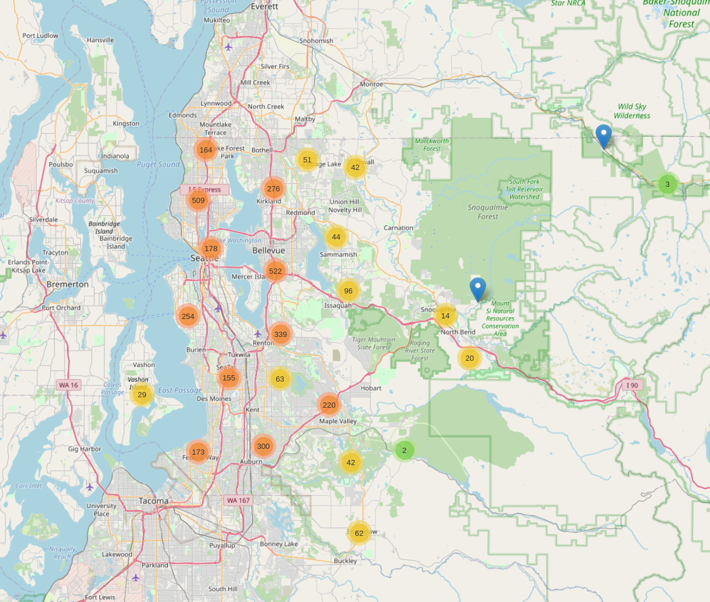
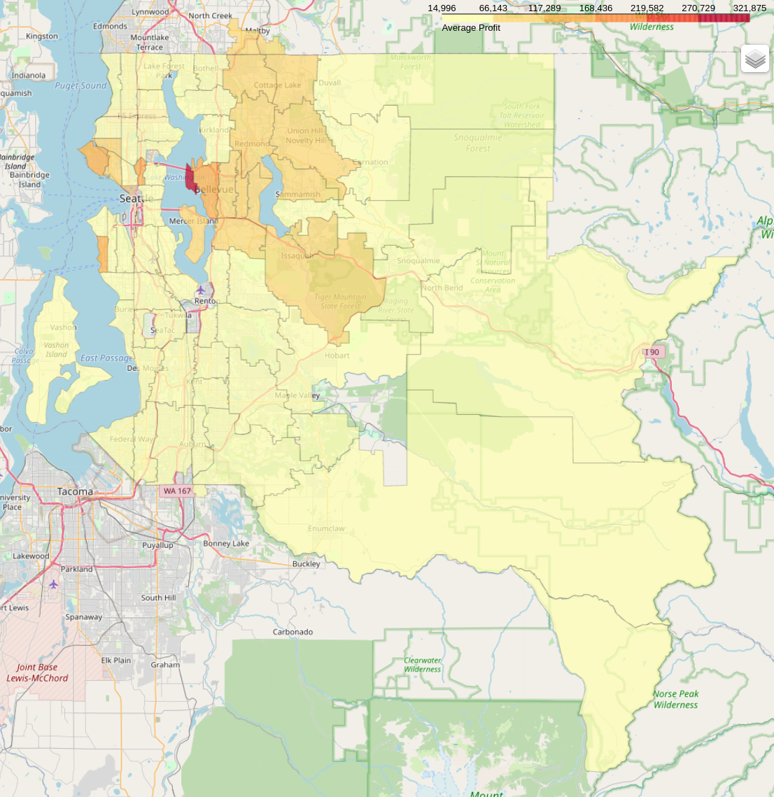

# Real Estate Investment Recommendation System

This project is a recommendation system for Real Estate companies based on insights extracted from exploratory data analysis, to answer to real estate common business questions. The rationale and the development can be followed on my jupyter  and also visualize dashboards on a more centralized and interactive way through my [Real Estate Recommendation Report App](url). 

The analysis was done over some data of sold houses from King County, in Seattle, USA. The data was obtained from [Kaggle](https://www.kaggle.com/harlfoxem/housesalesprediction)

## 1. **Business Understanding**
    
Domain: Real Estate.

Business Model: Buy houses for a price value and sell them for a higher price to make profit.
    
---    
## 2. **Business Problems (ficticious problems presented by business experts)**
1. Which houses should be bought and for what price?
2. Once its bought when it's the best time period to sell it and for what price?
3. To rise the housing selling price, the company should do a renovation. So what would be good renewal changes?

---
## 3. **Solution Strategy**

**Step 1. Data Attributes Description**

The original variables are:
 
    
|***Attribute*** | ***Description*** |
| -------- | --------- |
|**id** | a unique identifier number for each unique house |
|**date** | the date when the house was sold |
|**price** | the selling price when the house was sold |
|**bedrooms** | number of bedrooms in the house |
|**bathrooms** | number of bathrooms in the house, where a fraction like 0.25 represents a bathroom sink, shower or toilet |
|**sqft_living** | square footage of the apartments interior living space |
|**sqft_lot** | the size of the land in square feet |
|**floors** | number of floors in the house | 
|**waterfront** | if there is a waterview from the house | 
|**view** | an index from 0 to 4 of how good the view of the property was or how many views the house has | 
|**condition** | the house preservation condition | 
|**grade** | a rank from 1 to 13, which ranks the construction quality | 
|**sqft_above** | the size of the house above the ground level in square feet |
|**sqft_basement** | the size of the house below the ground level in square feet | 
|**yr_built** | the year the house was initially built | 
|**yr_renovated** | the year of the house's last renovation | 
|**zipcode** | what zipcode area the house is in | 
|**lat** | Latitude | 
|**long** | Longitude | 
|**sqft_livining15** | The square footage of interior housing living space for the nearest 15 neighbors (possibly) | 
|**sqft_lot15**| The square footage of the land lots of the nearest 15 neighbors | 

**Step 2. Descriptive Statistics Analysis:**

Analyzed each of the columns providing descriptive metrics for each attribute, obtaining a table with a statistical summary of the dataframe.

Housing price is varying from 75 000.00$ to 7 700 000.00$ which reveals a wide range of values. By looking to median price, 50% of the houses on King County costs equal or less than 450 000.00$, and comparing to the mean value, 540 088.14$, I can assume that are houses with much higher prices pushing the mean far from the median, so the distribution is skewed right with a skew of 4.02. In terms of more price concentration of houses, by looking at kurtosis there are many houses around the mode of 350 000.00$. Since it is right skewed the most interesting extreme values are to the left, and 75% of the houses price value are equal or below 645 000.00$, and 94.70% of the houses are up to 1 129 575.00$, there being 1146 houses above this value that could be statistically considered outliers.

**Step 3. Defined Business Data Assumptions:**

- Region granularity

  There is some difference between sub-regions in King County, so there must be a separation between regions, and have a specific analysis                 for each one. Since a generalized analysis would nullify the correlation of each region, and would be harder to take insights. This region               segmentation can be made in different granularities, that is it can be divided by North, South, and East Mountains, but it can also have                 a finer granularity that is for zipcode regions. Another finer granularity can be the street or street block by collecting that data from                 the latitude and longitude, and counting the number of houses per region to assess if there is enough data for each street to get                         significant statistical data.

- Bedrooms inconsistency

    Houses with 0 bedrooms, may be for other purposes apart from living usage.

- Year Renovated inconsistency

    It can be assumed that houses with value 0 on yr_renovated is basically houses that have not been renovated yet.

- Condition vs Grade relevance

    The condition variable it seems to have a higher weight in long-term than grade, in terms of evaluating which houses are better to buy,                   since the grade is the infraestructure construction quality and it cannot change so much with time, unlike condition that is the house                   preservation and it can it can increase with some maintenance works. 
                
- Useful Attributes for business question:

    To calculate a more fair median price, each house will be aggregated not only by zipcode but by living_size and lot_size, to calculate a more fair median price.

**Step 4. Data transformation according to business assumptions and feature engineering based on useful attributes and derived ones.**

The new and derived variables are:
 
    
|***Attribute*** | ***Description*** |
| -------- | --------- |
|**m2_living** | squared meters of the apartments interior living space |
|**m2_lot** | the size of the land in squared meters |
|**house_total_m2** | the sum of m2_living and m2_lot |
|**price/m2** | the price normalized by the total house size |
|**living_size** | the categorical size of the living part of the house which could be a small_house, medium_house or a large_house |
|**lot_size** | the categorical size of the land which could be a small_terrain, medium_terrain or a large_terrain |
|**median_price** | resulting from aggregating all houses by ['zipcode','living_size','lot_size'] |
|**median_price/m2** | calculating its median price per m2 per region per living size and per lot size | 
|**status** | a auxiliar variable to label what houses to buy, to consider buying, to compare and not worth buying | 
|**perc_value_below_median_price** | a percentage of how below the acquiring price is from the median_price | 
|**season** | the season within the four seasons in which the house was sold | 
|**best_season_median_price** | the median_price per m2 per region, living size, lot size and per season | 
|**best_season** | the season within the four seasons in which got the best median_price and it is potential to sell |
|**selling_price** | the selling price estimated with empirical rules taking into account the perc_value_below_median_price and the condition | 
|**best_season_selling_price** | the selling price based estimated with empirical rules taking also into account the season | 
|**profit** | the profit taken from acquiring a recommended house for a price and selling by the selling_price | 
|**best_season_profit_est** | the profit taken from acquiring a recommended house for a price and selling by the best_season_selling_price | 

 

---
## 4. **Recommendation Report to answer business experts**
    
### **1. Which houses should be bought and for what price?** 

The recommendation solution will output houses to buy and not to buy based on the median price of the respective region, because residence  localization is an important business information, and more specifically based on the median price of that region but taking into account groups of houses with the same living and lot area size, since its an important house comparison metric, because the price of a house with  60m² that is below the median price of its region does not tell that it is a potential house to buy and sell for a higher price near this region median, since the region property size distribution may be more concentrated on bigger sizes, hence the median price it's also bigger. 

So, it is better to use a metric like median price of the aggregation with the finer granularity of the property size, to do a fair evaluation of the real estate or the property size appreciation for each region, that then can be influenced by other variables like the mobility access of that region, and what offers there are in terms of market and public spaces. 

Denoting that this decision making process will be based on the infraestructure construction area and its locatization that are the aspects of the house that would be less probable to be changed over time, unlike some maintenance or renovation works to preserve the house which could be done to improve and increase that property pricing appreciation. 

The price value will be used to calculate the profit, from the difference with the selling price obtained through an increase on appreciation of the last selling price, that could have suffered from market inflation, because the works expenses always increase each year and consequently other services, and the house value itself as a valuable asset, from the possible increase with market appreciation considering a higher house demand and less offering effect, and of course some renovation works.

The decision to buy the houses is fundamentally based on the potential profit based on the expenses and the potential margin to increase the selling price value. The houses not considered to buy, can have different evaluation afterwards.

Why using median price and not mean?

The mean is usually influenced by higher values, so depending on the identities attribute distribution, e.g. the houses pricing value distribution, it may be a bad metric to make decisions upon this baseline. Instead we will use median, that is less prone to follow bigger values. 

**1. Identify best houses with comparison within each region**

**-** The houses that have a price value lower than the median price, compared with houses that belong to the same region, and are in good conditions (condition $\epsilon$ [3,5]), can be sold for a higher price, so are good to buy.

**-** The houses that have a price value lower than the median price, compared with houses that belong to the same region, and are in bad conditions (condition $\epsilon$ [0,2]), cannot be sold for a higher price, so are not worth buying.

**-** The houses that have a price value higher than the median price, compared with houses that belong to the same region, independently from the condition, are not good to buy in order to make good profit, but are going to be good for future comparison.

**-** The condition rank 3 takes into consideration that houses from a region that are below the region median price but has a medium condition it's better than low condition houses that would need more renovation and could not have profit by taking into account the expenses, and has more potential to be sold above the median price of the region and get a higher profit since it has more margin for renewal and maintenance to increase the preservation condition unlike the houses with already good conditions.  

**-** Houses with condition rank 4 or 5, do not need that investment on renewal works but being below the median price, it could be a good buying option since it will suffer from value appreciation throughout time, without the short-term investment on renewing.

Labels:

- 'to buy'
- 'to consider'
- 'to compare' (when founding what renovations to do or ammenities to be added on the properties above the median price it can be compared with renewal margin properties that were below the median)
- 'not worth buying'

**2. Define a selling price estimation**

**-** Assuming that the houses to buy have preservation condition rank between 3 and 5, there is some expectancy to have more profit gradually from houses with rank 3 to 5, on ascending order. Since the houses with rank 5 may have been sold below the region median because of bad real estate marketing strategy, or it was sold on a time period of low appreciation, that will be studied on the next business question. And the rank 3 were more probable sold below that appreciation value because of obvious lower preservation conditions and few amenities. 

**-** But since the previous rationale results on a recommendation of over 10 000 houses, half of the portfolio, does not seem to be a very realistic analysis. So it would be better to forget in the beginning the strategy of acquiring as well the houses with condition of 3, that would be more susceptible to short-term investment decisions on renewals and bigger initial investment.

**-** So I set some different levels of increasing expectancy on houses appreciation, only for houses ranked with 4 and 5 condition:

1. giving a 50% increase estimation on selling price, for houses with their last price being between 50% and 75% below the region median price/m2, for houses with condition rank 4,
2. then between 25% and 50% an appreciation of 25%, and from 0 to 25% half of the appreciation. 
3. and for houses with condition rank 5, the same appreciation model but with less 5% on each interval.

**3. Ordering houses to buy with defined priorities**

1. Ordered by percentage_below_median_price, on a descending order
2. then by condition, on a ascending order
3. then by profit, on a descending order

I'm giving priority to the percentage value below the median price because it is the metric that gives more confidence since it has less derivation dependency, i.e. it results directly from measuring the rate of the price over median price, unlike profit that is based on a selling price derivation, and the selling price is found based on empirical business assumptions.

**4. Visualize recommended houses**

1. Recommended houses Density Map

2. Recommended houses average profit per zipcode (Cloropleth Map)

Labelling Distribution:
| _house_status_       | _N_houses_ |
| :-----              | :-----   |
| not worth buying    | 7495     |
| to consider         | 6888     |
| to compare          | 3670     |
| to buy              | 3560     |

### **2. Once its bought when it's the best time period to sell it and for what price?**

After having a value appreciation on the previous conditions based on real estate natural appreciation and some renewal works, the selling price can also suffer from other appreciation by taking into account the best season in which the houses on the same category were sold for a higher value.

So for all houses where its appreciated selling price are still below the best season median price of its zipcode, living and lot size category, the selling price will get more 5% of appreciation rate. If it is already above, there is no extra season appreciation.

| _zipcode_  | _living_size_   | _lot_size_         | _best_season_  | _best_season_median_price_ |
| :-----     | :-----          | :-----             | :-----      | :-----    |
| 98001      |	large_house	   | large_terrain	    | summer      | 430000.00 |
| 98001	     | large_house	   |  medium_terrain	| spring	  | 409000.00 |
| 98001	     | medium_house    | large_terrain	    | summer	  | 270000.00 |
| 98001	     | medium_house    | medium_terrain	    | summer	  | 249900.00 |
| 98001	     | medium_house    | small_terrain	    | spring	  | 239950.00 |

Here is an example of what is the best season and best season median price for each total size and season granularity of zipcode 98001.

### **3. To rise the housing selling price, the company should do a renovation. So what would be good renewal changes?**

- Compare by only see the amenity between houses labelled 'to buy' and 'to compare', 
- For a specific zipcode region, returns a set of histograms, one on each column for each living_size and on each row for lot_size. 
    On each graph the x-axis will be the amenity and the y-axis the number of amenities.

    
For example, on the zipcode 98005, the houses to compare, that were the ones above the median price and their condition were higher than 3, have more bathroom amenities on general, and also for properties with living and lot large and medium size.
      
---      
## 5. **Business Results**

There are **3 investment yield profit scenarios**, for some fix and flip or only market appreciation with time, according to some criteria:

1. The profit obtained buying the recommended houses by only considering the zipcode, the property total size category and its condition, with the filters already explained above, is equal to **214,912,301.65$**

2. If we try to sell all the **3560 recommeded houses** considering the best season the profit will go up by 10% with over **237 million $**.

3. And if we want to be more precise we would want to buy the houses on the areas where the profit is higher, let's say the **top 5** zipcodes.

|zipcode	| best_season_profit_est|
| :-----    | :----- |
|	98039	| 321875.00 |
|   98004	| 131043.75 |
|	98112	| 121875.00 |
|	98040	| 108650.00 |
|	98102   | 95000.00 |	

Hence the sum of the median profit for the top 5 zip codes totals 778,443.75$ with an initial investment of 4,750,000.0$ and a sales revenue of 5,565,827.40$  

---
## 6. **Conclusion**

This project is a Data Analysis which was tailored to find actionable insights and therefore solutions to the real estate business experts specific problems.

From the profits I can conclude that there is margin of investment within King County.

To make the report easy and interactive I built an app to run on a cloud application, which can accessed by clicking on
[Real Estate Recommendation Report App](url). Additionally it can be found some dashboards with interactive visualization graphs and maps. 
    
---    
## 7. **Next actionable steps**

1. Use the normalized variables of price/m2 and median_price/m2
2. Do another EDA cycle to take more insights
3. Define the selling prices based on more data insights
4. Recommended houses based on a score

---
## 8. Author
   Michael Madeira

  
 
      
    

